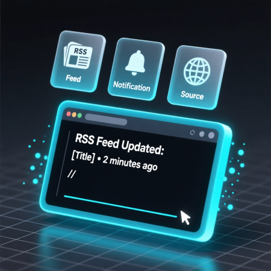

# Terminal RSS Feed Reader


A command-line RSS feed reader that allows you to manage and read RSS feeds from a markdown file, with both command-line and rich terminal UI options.

## Features

- Read RSS feeds from a `feeds.md` markdown file
- Add new feeds from the command line
- Colorful terminal output for better readability
- List all configured feeds
- Configurable number of entries to display per feed
- Simple markdown format for storing feeds
- Rich Textual-based terminal UI (new!)

## Requirements

- Python 3.6+
- Virtual environment (recommended)

## Installation

1. Clone or download the project
2. Create a virtual environment:
   ```bash
   python3 -m venv venv
   source venv/bin/activate  # On Windows: venv\Scripts\activate
   ```
3. Install dependencies:
   ```bash
   pip install -r requirements.txt
   ```

## Usage

### Basic Usage

Read all feeds from the default `feeds.md` file:
```bash
python rss_reader.py
```

### Add a New Feed

Add a new RSS feed to your `feeds.md` file:
```bash
python rss_reader.py --add "https://feeds.bbci.co.uk/news/rss.xml" --name "BBC News"
```

### List All Feeds

List all feeds currently in your `feeds.md` file:
```bash
python rss_reader.py --list
```

### Show More Entries

Show up to 10 entries per feed (default is 5):
```bash
python rss_reader.py --max-entries 10
```

### Use Custom Feeds File

Specify a different markdown file for feeds:
```bash
python rss_reader.py --file my_custom_feeds.md
```

## Configuration

The application uses a `feeds.md` file to store RSS feeds. The file should contain markdown links in the format:

```markdown
# RSS Feeds

## Technology
- [Hacker News](https://news.ycombinator.com/rss)
- [TechCrunch](https://techcrunch.com/feed/)

## News
- [BBC News](https://feeds.bbci.co.uk/news/rss.xml)
```

## Project Structure

```
rss_reader/
├── rss_reader.py        # Main application
├── requirements.txt     # Python dependencies
├── feeds.md            # Default RSS feeds file
├── test_rss_reader.py  # Unit tests
└── README.md           # This file
```

## Textual Interface (Rich Terminal UI)

The application now includes a rich terminal UI built with the Textual library. To run the Textual interface:

```bash
python textual_rss_reader.py
```

### Textual Interface Features:
- Interactive feed browsing with arrow keys
- Clean, organized display of feeds and articles
- Keyboard shortcuts for navigation
- Ability to open articles in your default browser
- Refresh feeds with a key press

### Textual Controls:
- `q`: Quit the application
- `a`: Add a new feed (hardcoded in this example, would need input dialog in full implementation)
- `r`: Refresh feeds
- `f`: Return to feeds view

## Running Tests

To run the unit tests:
```bash
pip install pytest
python -m pytest test_rss_reader.py -v
```

## Dependencies

- `feedparser`: For parsing RSS feeds
- `colorama`: For colored terminal output
- `requests`: For HTTP requests (if needed)
- `argparse`: For command-line argument parsing (built into Python)

## Contributing

1. Fork the repository
2. Create a feature branch
3. Make your changes
4. Add tests if applicable
5. Submit a pull request

## License

[Specify your license here]